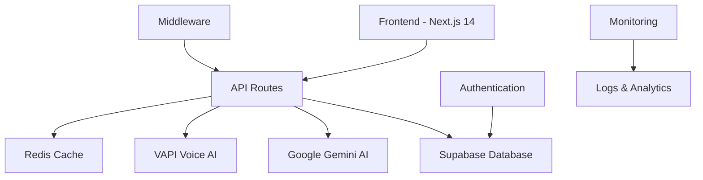

# 🔮 PrismAI - Intelligent Business Automation Platform

<div align="center">
  
  
  
  
  
</div>

## 🌟 Overview

**Refract your business potential through AI.** PrismAI is a sophisticated intelligent business automation platform that transforms every customer interaction into measurable growth. Like a prism refracts light into its full spectrum, PrismAI refracts your business data into actionable insights across multiple channels - voice, chat, email, and social media.

Built with modern technologies and production-ready features, PrismAI provides businesses with human-like AI assistants capable of handling calls, generating leads, automating customer service, and delivering comprehensive business intelligence.

### ✨ Key Features

- 🤖 **AI-Powered Voice Conversations** - Natural phone interactions using GPT-4 and ElevenLabs
- 📅 **Intelligent Appointment Booking** - Automated scheduling with business rules and preferences
- 🎯 **Advanced Lead Generation** - Multi-channel capture with AI-powered scoring and nurturing
- 💬 **Omnichannel Customer Service** - WhatsApp, SMS, chat, and voice support unified
- 📊 **Real-time Business Analytics** - Performance metrics, conversion tracking, and predictive insights
- 🔐 **Enterprise Security** - Row-level security, input validation, and comprehensive audit logging
- 🌐 **Multi-tenant SaaS Architecture** - Secure user isolation and customizable business configurations
- ⚡ **High Performance** - Optimized with intelligent caching, lazy loading, and global CDN
- 🧪 **Fully Tested** - Comprehensive unit tests, E2E tests, and security audits
- 🚀 **Production Ready** - CI/CD pipelines, monitoring, error handling, and auto-scaling

## 🏗️ Architecture



### 🛠️ Tech Stack

**Frontend:**
- **Next.js 14** - App Router, Server Components, API Routes
- **TypeScript 5** - Type safety and developer experience
- **Tailwind CSS** - Utility-first styling with design system
- **Radix UI** - Accessible, unstyled UI primitives
- **React Hook Form** - Form state management with validation

**Backend & Services:**
- **Supabase** - PostgreSQL database with real-time features
- **Google Gemini 1.5** - Advanced language model for conversations
- **VAPI** - Voice AI platform for phone call handling
- **ElevenLabs** - High-quality voice synthesis

**Infrastructure:**
- **Vercel** - Deployment and hosting (recommended)
- **Redis/Upstash** - Caching and session storage
- **GitHub Actions** - CI/CD pipeline with quality gates

## 🚀 Quick Start

### Prerequisites

- **Node.js 18+** and **npm/pnpm**
- **Supabase Account** for database
- **Google Gemini API Key** for AI processing
- **VAPI Account** for voice integration

### 1. Clone and Install

```bash
git clone https://github.com/your-username/prismai-platform.git
cd prismai-platform
npm install
```

### 2. Environment Setup

```bash
# Copy environment template
cp .env.example .env.local

# Edit with your API keys and configuration
nano .env.local
```

**Required Environment Variables:**
```bash
# Application
NEXT_PUBLIC_APP_URL=http://localhost:3000
NEXT_PUBLIC_APP_NAME=PrismAI
NEXT_PUBLIC_APP_DESCRIPTION="Intelligent Business Automation Platform"

# Supabase (Required)
NEXT_PUBLIC_SUPABASE_URL=your_supabase_project_url
NEXT_PUBLIC_SUPABASE_ANON_KEY=your_supabase_anon_key
SUPABASE_SERVICE_ROLE_KEY=your_supabase_service_role_key

# AI Services (Required)
GEMINI_API_KEY=your_gemini_api_key
VAPI_API_KEY=your_vapi_api_key
```

### 3. Database Setup

```bash
# Run database migrations
psql -h your-supabase-host -U postgres -d postgres -f scripts/001_create_database_schema.sql
```

### 4. Development Server

```bash
# Start development server
npm run dev

# Open browser
open http://localhost:3000
```

## 📚 Documentation

### Essential Guides

- **[Deployment Guide](./DEPLOYMENT.md)** - Production deployment instructions
- **[API Reference](./docs/API.md)** - Complete API documentation
- **[Environment Variables](./docs/ENVIRONMENT.md)** - Configuration reference
- **[Security Guide](./docs/SECURITY.md)** - Security best practices

### Development

- **[Contributing Guide](./docs/CONTRIBUTING.md)** - How to contribute
- **[Testing Guide](./docs/TESTING.md)** - Running and writing tests
- **[Architecture Guide](./docs/ARCHITECTURE.md)** - System design details

## 🧪 Testing

```bash
# Unit tests
npm run test
npm run test:watch
npm run test:coverage

# E2E tests
npm run test:e2e

# Type checking
npm run typecheck

# Linting
npm run lint
```

## 📊 Monitoring & Health

### Health Check
```bash
# Check application health
curl http://localhost:3000/api/health

# Detailed health with auth
curl "http://localhost:3000/api/health?token=your_health_token"
```

### Performance Monitoring
- **Response Times** - API endpoint performance
- **Error Rates** - Application error tracking
- **Resource Usage** - Memory and CPU monitoring
- **External Services** - Third-party API health

## 🔒 Security Features

- **🛡️ Input Validation** - Zod schemas with sanitization
- **🔐 Authentication** - Supabase Auth with JWT
- **🚦 Rate Limiting** - Multi-tier rate limiting
- **🔒 CSRF Protection** - Token-based CSRF prevention
- **📝 Audit Logging** - Security event tracking
- **🔍 Vulnerability Scanning** - Automated dependency audits

## ⚡ Performance Features

- **🚀 Code Splitting** - Dynamic imports and lazy loading
- **💾 Caching** - Multi-layer caching strategy
- **🗜️ Compression** - Gzip and Brotli compression
- **🖼️ Image Optimization** - Next.js Image component
- **📦 Bundle Analysis** - Size monitoring and optimization

## 🔧 Configuration

### Environment Variables

The application uses a tiered configuration system:

1. **Required** - Core functionality (database, AI services)
2. **Optional** - Enhanced features (monitoring, caching)
3. **Development** - Debug and testing features

See [.env.example](./.env.example) for complete reference.

### Feature Flags

Features are automatically enabled based on environment variables:

```typescript
export const features = {
  analytics: !!env.VERCEL_ANALYTICS_ID,
  monitoring: !!env.SENTRY_DSN,
  email: !!(env.RESEND_API_KEY || env.SMTP_HOST),
  caching: !!(env.REDIS_URL || env.UPSTASH_REDIS_REST_URL),
  webhooks: !!env.WEBHOOK_SECRET,
}
```

## 🚀 Deployment

### Vercel (Recommended)

```bash
# Install Vercel CLI
npm install -g vercel

# Deploy
vercel --prod
```

### Other Platforms

- **Netlify** - Static site deployment
- **Railway** - Full-stack deployment
- **Docker** - Containerized deployment
- **AWS/GCP** - Cloud platform deployment

See [DEPLOYMENT.md](./DEPLOYMENT.md) for detailed instructions.

## 📈 Scaling

### Horizontal Scaling
- **Load Balancing** - Multiple instances
- **Database Scaling** - Read replicas
- **CDN Integration** - Global content delivery
- **Microservices** - Service decomposition

### Performance Optimization
- **Caching Strategy** - Redis/Upstash integration
- **Database Optimization** - Query optimization
- **Asset Optimization** - Image and bundle optimization
- **Monitoring** - Performance tracking

## 🔍 Troubleshooting

### Common Issues

1. **Environment Variables** - Check .env.local configuration
2. **Database Connection** - Verify Supabase credentials
3. **API Keys** - Ensure Gemini and VAPI keys are valid
4. **Build Errors** - Run `npm run typecheck`

### Debug Commands

```bash
# Check environment
npm run env:check

# Test database connection
npm run db:test

# Validate configuration
npm run config:validate

# Run health checks
npm run health:check
```

## 🤝 Contributing

We welcome contributions! Please read our [Contributing Guide](./docs/CONTRIBUTING.md) for details on:

- Code style and standards
- Commit message format
- Pull request process
- Development workflow

### Development Workflow

```bash
# Create feature branch
git checkout -b feature/your-feature

# Make changes and test
npm run test
npm run lint

# Commit with conventional format
git commit -m "feat: add new feature"

# Push and create PR
git push origin feature/your-feature
```

## 📄 License

This project is licensed under the MIT License - see the [LICENSE](LICENSE) file for details.

## 🆘 Support

- **📚 Documentation** - Check our comprehensive docs
- **🐛 Issues** - Report bugs via GitHub Issues
- **💬 Discussions** - Community support and questions
- **📧 Email** - Contact support@prismai.com for enterprise support

## 🗺️ Roadmap

- [ ] **Voice Cloning** - Custom voice training for brand consistency
- [ ] **Multi-language Support** - International market expansion
- [ ] **Advanced Analytics** - ML-powered predictive insights
- [ ] **CRM Integrations** - Salesforce, HubSpot, and calendar sync
- [ ] **Mobile Applications** - iOS and Android native apps
- [ ] **API Marketplace** - Third-party integration ecosystem

---

<div align="center">
  <p>Built with ❤️ to refract business potential through AI</p>
  <p>⭐ Star this repo if you find it helpful!</p>
</div>"# Deployment fix applied" 
