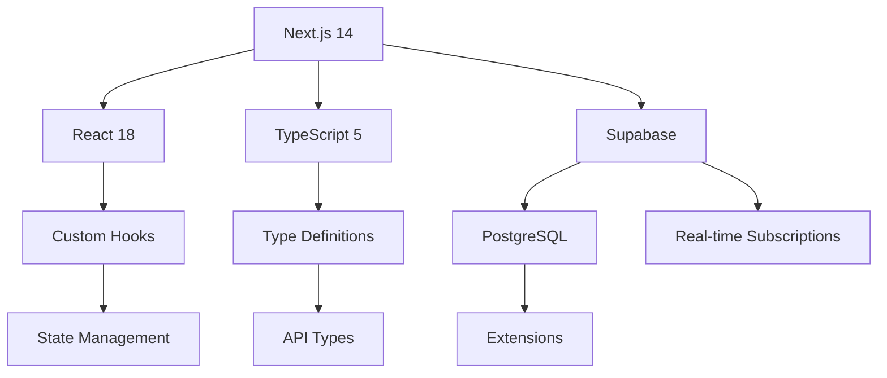
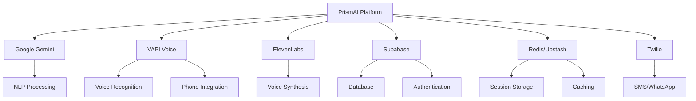
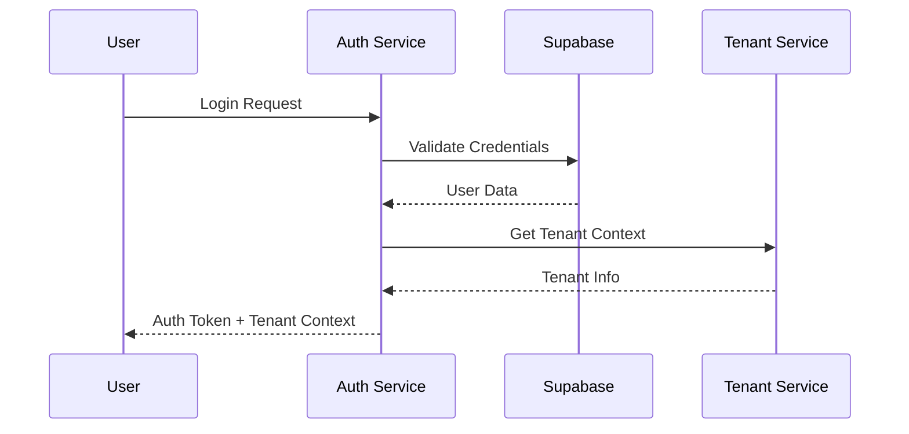
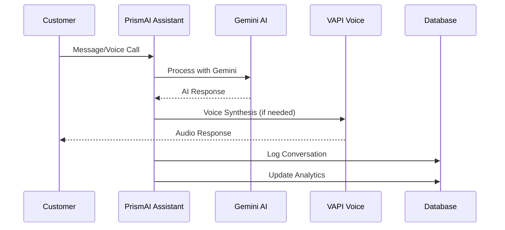
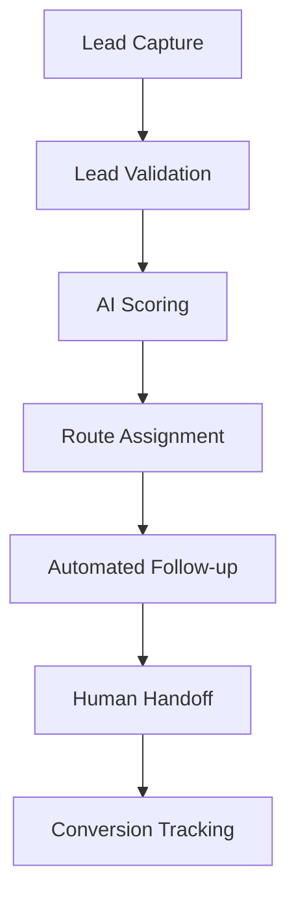
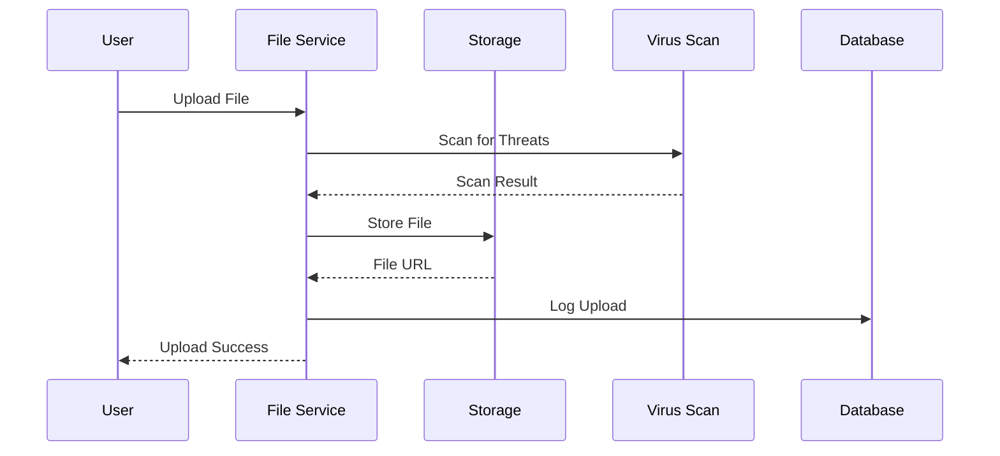
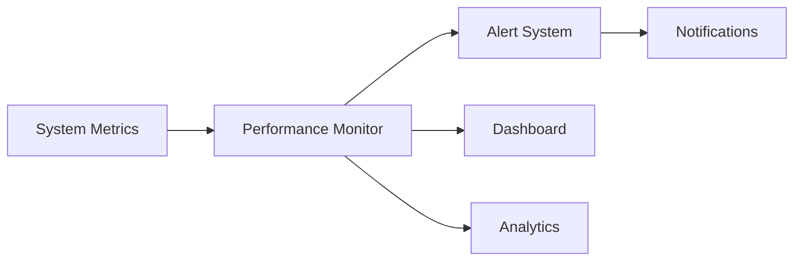

# PrismAI Platform - Complete AI-Contextualized Technical Reference

**Document Version**: 2.0.0  
**Generated**: 2025-11-11T10:30:36.970Z  
**Purpose**: Ultimate AI-contextualized technical documentation for comprehensive codebase understanding

---

## 📋 Executive Summary

The PrismAI Platform is a sophisticated AI-powered business automation suite designed for SMBs, featuring multi-channel customer service, lead generation, conversation intelligence, and business insights. This document provides complete technical context for AI systems to understand, analyze, modify, and extend the platform.

**Core Value Proposition**: "Refract your business potential through AI" - transforming every customer interaction into measurable growth across voice, chat, email, and social media channels.

---

## 🏗️ Complete File Tree Hierarchy

### Root Structure
```
prismai-platform/
├── .github/                    # CI/CD workflows and templates
├── .kilocode/                 # Internal development tools
├── __tests__/                 # Comprehensive test suite
│   ├── components/ui/         # UI component tests
│   ├── hooks/                 # Custom hooks tests  
│   ├── lib/                   # Library tests
│   │   ├── ai/               # AI service tests
│   │   ├── monitoring/       # Monitoring tests
│   │   └── security/         # Security tests
│   └── utils/                # Test utilities
├── app/                       # Next.js 14 application
│   ├── api/                  # API routes (RESTful)
│   │   ├── agents/           # Agent management endpoints
│   │   ├── analytics/        # Analytics and reporting
│   │   ├── conversation-insights/  # Conversation analysis
│   │   ├── conversation-intelligence/  # AI conversation features
│   │   ├── files/            # File management
│   │   ├── knowledge-base/   # Knowledge base operations
│   │   ├── monitoring/       # System monitoring
│   │   ├── quality/          # Quality management
│   │   └── surveys/          # Survey management
│   ├── globals.css           # Global styles
│   ├── layout.tsx            # Root layout component
│   ├── page.tsx              # Homepage
│   ├── privacy/page.tsx      # Privacy policy
│   ├── security/page.tsx     # Security documentation
│   ├── status/page.tsx       # System status
│   └── terms/page.tsx        # Terms of service
├── components/                # React components
│   ├── developer-portal/     # Developer portal components
│   ├── mcp/                  # MCP server components
│   ├── monitoring/           # Monitoring dashboards
│   ├── ui/                   # Design system components
│   │   ├── button.tsx        # Button component variants
│   │   ├── card.tsx          # Card layout system
│   │   ├── chart.tsx         # Data visualization
│   │   ├── dialog.tsx        # Modal dialogs
│   │   ├── form.tsx          # Form components
│   │   ├── input.tsx         # Input fields
│   │   ├── select.tsx        # Select dropdowns
│   │   ├── table.tsx         # Data tables
│   │   └── [28+ more UI components]
│   ├── DotGrid.tsx           # Background effects
│   ├── performance-monitor.tsx  # Real-time monitoring
│   ├── Prism.tsx             # Brand component
│   └── StaggeredMenu.tsx     # Navigation menu
├── deployment/                # Deployment configurations
│   ├── docker/               # Docker configurations
│   ├── environments/         # Environment configs
│   ├── monitoring/           # Monitoring setup
│   ├── scripts/              # Deployment scripts
│   └── docker-compose.production.yml  # Production stack
├── docs/                     # Documentation
│   ├── advanced-features-guide.md     # Feature documentation
│   ├── AI_RECEPTIONIST_OFFERING.md    # Product offering
│   ├── BUSINESS_CONTINUITY_PLAN.md    # Business continuity
│   ├── configuration-manual.md        # Configuration guide
│   ├── deployment-guide.md            # Deployment guide
│   ├── monitoring-guide.md            # Monitoring setup
│   ├── performance-tuning.md          # Performance optimization
│   ├── PRD_AI_BUSINESS_SUITE.md       # Product requirements
│   ├── PRISMAI_REBRANDING_CHECKLIST.md # Rebranding tasks
│   ├── PRISMAI_RISK_ASSESSMENT.md     # Risk analysis
│   ├── REBRANDING_STRATEGY_PRISMAI.md # Rebranding strategy
│   ├── security-guidelines.md         # Security guidelines
│   └── troubleshooting-manual.md      # Troubleshooting guide
├── hooks/                    # Custom React hooks
│   ├── use-conversation.ts   # Conversation management
│   ├── use-ai-assistant.ts   # AI assistant integration
│   └── use-mobile.ts         # Mobile responsiveness
├── lib/                      # Core library modules
│   ├── ab-testing/          # A/B testing engine
│   ├── ai/                  # AI service integrations
│   ├── analytics/           # Analytics and insights
│   ├── api/                 # API utilities
│   ├── crm/                 # CRM integrations
│   ├── engagement-tracking/ # User engagement
│   ├── monitoring/          # System monitoring
│   ├── personalization/     # AI personalization
│   ├── phi/                 # PHI compliance
│   ├── predictive-scoring/  # ML scoring models
│   ├── privacy/             # Privacy protection
│   ├── rate-limit/          # Rate limiting
│   ├── security/            # Security utilities
│   ├── supabase/            # Database client
│   ├── tenant/              # Multi-tenant support
│   ├── translate/           # Translation services
│   ├── twilio/              # Communication services
│   ├── types/               # TypeScript definitions
│   ├── websocket/           # WebSocket handlers
│   ├── workflows/           # Business workflows
│   └── [utility modules]
├── middleware/               # Next.js middleware
├── ml_service/              # Machine learning service
├── public/                   # Static assets
├── scripts/                 # Database migrations
├── styles/                  # Additional styles
├── CHANGELOG.md             # Version history
├── DEPLOYMENT.md            # Deployment guide
├── PROJECT_TECHNICAL_CATALOG.md  # Technical catalog
├── package.json             # Dependencies and scripts
├── next.config.mjs          # Next.js configuration
├── tailwind.config.js       # Tailwind configuration
└── [config files]
```

---

## 🔧 Technology Stack

### Core Framework
- **Next.js 14**: App Router, Server Components, API Routes
- **TypeScript 5**: Type safety and developer experience
- **React 18**: Component-based UI framework
- **Tailwind CSS 3.4**: Utility-first styling

### Backend & Database
- **Supabase**: PostgreSQL with real-time features
- **PostgreSQL**: Primary database with extensions
  - `uuid-ossp`: UUID generation
  - `pgcrypto`: Encryption functions
  - `pg_stat_statements`: Query performance
  - `pg_buffercache`: Buffer cache monitoring
  - `vector`: AI/vector search capabilities

### AI Services
- **Google Gemini 1.5**: Language model for conversations
- **VAPI**: Voice AI platform for phone calls
- **ElevenLabs**: High-quality voice synthesis

### Infrastructure
- **Vercel**: Deployment and hosting
- **Redis/Upstash**: Caching and session storage
- **GitHub Actions**: CI/CD pipeline
- **Docker**: Containerization (deployment)

### Development Tools
- **Jest 29.7**: Unit testing framework
- **Playwright**: E2E testing
- **ESLint**: Code linting
- **Prettier**: Code formatting
- **TypeScript Compiler**: Type checking

---

## 🎯 Core Features Architecture

### 1. PrismAI Assistant (Voice + Chat)
- **Voice Handling**: Natural phone conversations using VAPI + Gemini
- **Chat Interface**: Real-time web chat with AI
- **Appointment Booking**: Automated scheduling with business rules
- **Call Analytics**: Performance metrics and conversation insights

### 2. Lead Generation Engine
- **Multi-Channel Capture**: Web forms, chat, social media, email
- **AI Lead Scoring**: Intelligent qualification using behavioral data
- **Automated Outreach**: Personalized follow-up sequences
- **Lead Nurturing**: Drip campaigns with smart triggers

### 3. Customer Service Automation
- **24/7 Support**: WhatsApp, SMS, chat, and voice integration
- **Dynamic FAQ**: AI-powered knowledge base
- **Ticket Routing**: Intelligent escalation to human agents
- **Quality Scoring**: Performance metrics and compliance

### 4. Analytics & Insights
- **Conversation Intelligence**: Pattern analysis and insights
- **Performance Monitoring**: Real-time system metrics
- **Business Intelligence**: KPI tracking and reporting
- **Predictive Analytics**: ML-powered forecasting

### 5. Enterprise Features
- **Multi-tenant Architecture**: Secure user isolation
- **Role-based Access Control**: Admin, manager, user permissions
- **Audit Logging**: Complete activity tracking
- **Compliance**: SOC 2, GDPR, CCPA support

---

## 🔌 API Endpoints Catalog

### Agent Management (`/api/agents/`)
- `GET /agents` - List all agents
- `POST /agents` - Create new agent
- `GET /agents/{id}` - Get agent details
- `PUT /agents/{id}` - Update agent
- `DELETE /agents/{id}` - Delete agent
- `GET /agents/metrics` - Agent performance metrics
- `GET /agents/goals` - Agent goal tracking
- `POST /agents/{id}/goals` - Set agent goals

### Analytics (`/api/analytics/`)
- `GET /analytics/dashboard` - Dashboard data
- `GET /analytics/conversations` - Conversation analytics
- `POST /analytics/export` - Export analytics data
- `GET /analytics/customer-service` - Customer service metrics
- `GET /analytics/performance` - Performance analytics

### Conversation Insights (`/api/conversation-insights/`)
- `GET /patterns/{tenantId}` - Pattern analysis
- `GET /summarize/{conversationId}` - Conversation summary
- `GET /trends/{timeframe}` - Trend analysis
- `POST /analyze` - Real-time analysis

### Conversation Intelligence (`/api/conversation-intelligence/`)
- `GET /insights/{conversationId}` - AI conversation insights
- `POST /analyze` - Analyze conversation
- `GET /emotions/{conversationId}` - Emotion analysis
- `GET /intents/{conversationId}` - Intent recognition

### File Management (`/api/files/`)
- `POST /upload` - File upload
- `GET /` - List files
- `GET /{id}` - Get file details
- `DELETE /{id}` - Delete file

### Knowledge Base (`/api/knowledge-base/`)
- `GET /` - List knowledge base entries
- `POST /` - Create new entry
- `POST /import` - Bulk import
- `GET /search` - Search entries
- `PUT /{id}` - Update entry

### Monitoring (`/api/monitoring/`)
- `GET /metrics` - System metrics
- `GET /performance` - Performance data
- `GET /agents` - Agent monitoring
- `GET /alerts` - Active alerts
- `POST /alerts` - Create alert

### Quality Management (`/api/quality/`)
- `GET /criteria` - Quality criteria
- `POST /criteria` - Create criteria
- `GET /reviews` - Quality reviews
- `POST /reviews` - Create review

### Survey Management (`/api/surveys/`)
- `GET /templates` - Survey templates
- `POST /templates` - Create template
- `GET /templates/{id}` - Get template
- `PUT /templates/{id}` - Update template
- `DELETE /templates/{id}` - Delete template

---

## ⚙️ Configuration Parameters

### Environment Variables

#### Required Configuration
```typescript
// Application
NEXT_PUBLIC_APP_URL: string           // Application URL
NEXT_PUBLIC_SUPABASE_URL: string      // Supabase project URL
NEXT_PUBLIC_SUPABASE_ANON_KEY: string // Supabase anonymous key
SUPABASE_SERVICE_ROLE_KEY: string     // Supabase service role key

// AI Services
GEMINI_API_KEY: string               // Google Gemini API key
VAPI_API_KEY: string                 // VAPI voice service key
```

#### Optional Configuration
```typescript
// Analytics & Monitoring
VERCEL_ANALYTICS_ID?: string         // Vercel analytics ID
SENTRY_DSN?: string                  // Error monitoring

// Email Services
RESEND_API_KEY?: string              // Resend email service
SMTP_HOST?: string                   // SMTP server
SMTP_PORT?: number                   // SMTP port
SMTP_USER?: string                   // SMTP username
SMTP_PASS?: string                   // SMTP password

// Security
JWT_SECRET?: string                  // JWT signing secret
ENCRYPTION_KEY?: string              // Data encryption key
WEBHOOK_SECRET?: string              // Webhook validation

// Caching
UPSTASH_REDIS_REST_URL?: string      // Upstash Redis URL
UPSTASH_REDIS_REST_TOKEN?: string    // Upstash Redis token
REDIS_URL?: string                   // Standard Redis URL

// Performance
DATABASE_CONNECTION_LIMIT: number    // DB connection pool size (default: 20)
HEALTH_CHECK_TOKEN?: string          // Health check authorization
```

#### Feature Flags
```typescript
export const features = {
  analytics: !!env.VERCEL_ANALYTICS_ID,
  monitoring: !!env.SENTRY_DSN,
  email: !!(env.RESEND_API_KEY || (env.SMTP_HOST && env.SMTP_USER && env.SMTP_PASS)),
  caching: !!(env.REDIS_URL || env.UPSTASH_REDIS_REST_URL),
  webhooks: !!env.WEBHOOK_SECRET,
} as const
```

### Database Configuration
- **Connection Pool**: 20 connections (configurable)
- **Extensions**: uuid-ossp, pgcrypto, pg_stat_statements, pg_buffercache, vector
- **RLS**: Row Level Security enabled for all tables
- **Backup**: Automated daily backups
- **Replication**: Read replicas for performance

---

## 🔗 Dependency Graph

### Core Dependencies


### Service Dependencies


### Module Dependencies
```typescript
// lib/supabase/server.ts
import { createClient } from '@supabase/supabase-js'
import { cookies } from 'next/headers'

// lib/ai/gemini-client.ts  
import { GoogleGenerativeAI } from '@google/generative-ai'
import { env } from '@/lib/env'

// lib/monitoring/performance-monitor.ts
import { createClient } from '@/lib/supabase/server'
import { logger } from '@/lib/logger'

// lib/security/authentication.ts
import { createClient } from '@/lib/supabase/server'
import { JWT_SECRET } from '@/lib/env'
```

---

## 🌊 Data Flow Diagrams

### 1. User Authentication Flow


### 2. Conversation Flow with AI


### 3. Lead Processing Flow


### 4. File Upload and Processing


### 5. Real-time Monitoring Flow


---

## 🧠 Algorithmic Implementations

### 1. AI Integration Algorithms

#### Gemini AI Client (`lib/ai/gemini-client.ts`)
```typescript
interface GeminiConfig {
  model: string
  temperature: number
  maxOutputTokens: number
  topP: number
  topK: number
}

class GeminiClient {
  private client: GoogleGenerativeAI
  private model: GenerativeModel
  
  async generateResponse(
    prompt: string, 
    context?: ConversationContext
  ): Promise<AIResponse> {
    const model = this.client.getGenerativeModel({ 
      model: 'gemini-1.5-pro',
      generationConfig: {
        temperature: 0.7,
        topK: 40,
        topP: 0.95,
        maxOutputTokens: 1024,
      }
    })
    
    const result = await model.generateContent(prompt)
    return this.processResponse(result)
  }
}
```

#### VAPI Voice Integration
```typescript
interface VAPICallConfig {
  accessToken: string
  endpoint: string
  voice: string
  model: string
  messages: VAPIMessage[]
}

class VAPIClient {
  async initiateCall(config: VAPICallConfig): Promise<string> {
    const response = await fetch(`${this.baseURL}/phone-call`, {
      method: 'POST',
      headers: {
        'Authorization': `Bearer ${config.accessToken}`,
        'Content-Type': 'application/json'
      },
      body: JSON.stringify({
        type: 'phone-call',
        phoneNumber: config.phoneNumber,
        assistant: {
          model: config.model,
          voice: config.voice,
          messages: config.messages
        }
      })
    })
    
    return response.json()
  }
}
```

### 2. Vector Search Implementation

#### Knowledge Base Vector Search
```sql
-- Enable vector extension
CREATE EXTENSION IF NOT EXISTS vector;

-- Create vector column
ALTER TABLE knowledge_base 
ADD COLUMN embedding vector(1536);

-- Create vector index
CREATE INDEX ON knowledge_base 
USING ivfflat (embedding vector_cosine_ops) 
WITH (lists = 100);

-- Search function
CREATE OR REPLACE FUNCTION search_knowledge_base(
  query_embedding vector(1536),
  match_threshold float DEFAULT 0.78,
  match_count int DEFAULT 5
)
RETURNS TABLE (
  id uuid,
  content text,
  similarity float
)
LANGUAGE plpgsql
AS $$
BEGIN
  RETURN QUERY
  SELECT
    kb.id,
    kb.content,
    1 - (kb.embedding <=> query_embedding) as similarity
  FROM knowledge_base kb
  WHERE 1 - (kb.embedding <=> query_embedding) > match_threshold
  ORDER BY kb.embedding <=> query_embedding
  LIMIT match_count;
END;
$$;
```

### 3. Lead Scoring Algorithm
```typescript
interface LeadScore {
  profile: number        // Company size, industry match
  behavior: number       // Website activity, email engagement
  intent: number         // Keywords, download behavior
  timing: number         // Seasonal, business cycle factors
  fit: number           // ICP alignment
}

class LeadScoringEngine {
  calculateScore(lead: LeadData): number {
    const weights = {
      profile: 0.25,
      behavior: 0.30,
      intent: 0.25,
      timing: 0.10,
      fit: 0.10
    }
    
    const scores = {
      profile: this.scoreProfile(lead.company),
      behavior: this.scoreBehavior(lead.activities),
      intent: this.scoreIntent(lead.content),
      timing: this.scoreTiming(lead.timestamp),
      fit: this.scoreFit(lead.characteristics)
    }
    
    return Object.entries(weights).reduce((total, [key, weight]) => {
      return total + (scores[key as keyof LeadScore] * weight)
    }, 0)
  }
}
```

### 4. Intelligent Routing Algorithm
```typescript
class IntelligentRoutingEngine {
  async routeLead(lead: LeadData): Promise<RoutingDecision> {
    const agents = await this.getAvailableAgents()
    const routingFactors = {
      agentCapacity: await this.getAgentCapacity(),
      skillMatch: this.calculateSkillMatch(lead, agents),
      performance: this.getAgentPerformance(agents),
      leadValue: this.calculateLeadValue(lead),
      timezone: this.calculateTimezoneMatch(lead, agents)
    }
    
    const scores = agents.map(agent => ({
      agent,
      score: this.calculateRoutingScore(agent, routingFactors)
    }))
    
    return {
      selectedAgent: scores.sort((a, b) => b.score - a.score)[0].agent,
      score: scores[0].score,
      factors: routingFactors
    }
  }
}
```

### 5. Conversation Intelligence
```typescript
class ConversationAnalyzer {
  async analyzeConversation(conversation: ConversationData): Promise<AnalysisResult> {
    const [emotions, intents, sentiment, summary] = await Promise.all([
      this.analyzeEmotions(conversation.messages),
      this.extractIntents(conversation.messages),
      this.analyzeSentiment(conversation.messages),
      this.generateSummary(conversation.messages)
    ])
    
    return {
      emotions,
      intents,
      sentiment,
      summary,
      insights: this.generateInsights(conversation, emotions, intents, sentiment),
      recommendations: this.generateRecommendations(conversation, analysis)
    }
  }
}
```

---

## 🗄️ Database Schema Overview

### Core Tables

#### Users and Authentication
```sql
-- Auth users (Supabase managed)
auth.users (
  id uuid PRIMARY KEY,
  email text UNIQUE NOT NULL,
  created_at timestamp with time zone DEFAULT NOW()
)

-- User profiles
profiles (
  id uuid PRIMARY KEY REFERENCES auth.users(id),
  business_name text NOT NULL,
  business_type text,
  tenant_id uuid REFERENCES tenants(id),
  created_at timestamp with time zone DEFAULT NOW(),
  updated_at timestamp with time zone DEFAULT NOW()
)

-- Multi-tenant support
tenants (
  id uuid PRIMARY KEY DEFAULT uuid_generate_v4(),
  name text NOT NULL,
  domain text UNIQUE,
  subdomain text UNIQUE,
  subscription_status text DEFAULT 'trial',
  trial_ends_at timestamp with time zone,
  created_at timestamp with time zone DEFAULT NOW()
)

tenant_users (
  id uuid PRIMARY KEY DEFAULT uuid_generate_v4(),
  tenant_id uuid REFERENCES tenants(id),
  user_id uuid REFERENCES auth.users(id),
  role text NOT NULL CHECK (role IN ('owner', 'admin', 'manager', 'user')),
  is_active boolean DEFAULT true,
  joined_at timestamp with time zone DEFAULT NOW()
)
```

#### AI and Conversations
```sql
-- AI configurations
ai_configs (
  id uuid PRIMARY KEY DEFAULT uuid_generate_v4(),
  user_id uuid REFERENCES auth.users(id),
  tenant_id uuid REFERENCES tenants(id),
  gemini_config jsonb,
  vapi_config jsonb,
  voice_settings jsonb,
  personality_settings jsonb,
  created_at timestamp with time zone DEFAULT NOW()
)

-- Conversation management
conversations (
  id uuid PRIMARY KEY DEFAULT uuid_generate_v4(),
  tenant_id uuid REFERENCES tenants(id),
  user_id uuid REFERENCES auth.users(id),
  type text CHECK (type IN ('voice', 'chat', 'sms', 'whatsapp')),
  status text DEFAULT 'active',
  started_at timestamp with time zone DEFAULT NOW(),
  ended_at timestamp with time zone,
  metadata jsonb
)

-- Conversation messages
conversation_messages (
  id uuid PRIMARY KEY DEFAULT uuid_generate_v4(),
  conversation_id uuid REFERENCES conversations(id),
  tenant_id uuid REFERENCES tenants(id),
  sender_type text CHECK (sender_type IN ('user', 'assistant', 'system')),
  content text NOT NULL,
  message_type text DEFAULT 'text',
  metadata jsonb,
  timestamp timestamp with time zone DEFAULT NOW()
)

-- AI analysis results
conversation_insights (
  id uuid PRIMARY KEY DEFAULT uuid_generate_v4(),
  conversation_id uuid REFERENCES conversations(id),
  tenant_id uuid REFERENCES tenants(id),
  insight_type text NOT NULL,
  content jsonb,
  confidence_score decimal(3,2),
  created_at timestamp with time zone DEFAULT NOW()
)
```

#### Knowledge Base
```sql
-- Knowledge base entries
knowledge_base (
  id uuid PRIMARY KEY DEFAULT uuid_generate_v4(),
  tenant_id uuid REFERENCES tenants(id),
  title text NOT NULL,
  content text NOT NULL,
  category text,
  tags text[],
  embedding vector(1536), -- For vector search
  search_vector tsvector, -- For full-text search
  is_active boolean DEFAULT true,
  created_by uuid REFERENCES auth.users(id),
  created_at timestamp with time zone DEFAULT NOW(),
  updated_at timestamp with time zone DEFAULT NOW()
)
```

#### Lead Management
```sql
-- Lead sources
lead_sources (
  id uuid PRIMARY KEY DEFAULT uuid_generate_v4(),
  tenant_id uuid REFERENCES tenants(id),
  name text NOT NULL,
  type text CHECK (type IN ('website', 'chat', 'phone', 'social', 'email', 'referral')),
  configuration jsonb,
  is_active boolean DEFAULT true,
  created_at timestamp with time zone DEFAULT NOW()
)

-- Leads
leads (
  id uuid PRIMARY KEY DEFAULT uuid_generate_v4(),
  tenant_id uuid REFERENCES tenants(id),
  source_id uuid REFERENCES lead_sources(id),
  contact_info jsonb NOT NULL,
  company_info jsonb,
  lead_score decimal(3,2) DEFAULT 0,
  status text DEFAULT 'new' CHECK (status IN ('new', 'qualified', 'converted', 'lost')),
  assigned_to uuid REFERENCES auth.users(id),
  created_at timestamp with time zone DEFAULT NOW(),
  updated_at timestamp with time zone DEFAULT NOW()
)

-- Lead activities
lead_activities (
  id uuid PRIMARY KEY DEFAULT uuid_generate_v4(),
  lead_id uuid REFERENCES leads(id),
  tenant_id uuid REFERENCES tenants(id),
  activity_type text NOT NULL,
  description text,
  metadata jsonb,
  performed_by uuid REFERENCES auth.users(id),
  created_at timestamp with time zone DEFAULT NOW()
)
```

#### Analytics and Monitoring
```sql
-- Performance metrics
performance_metrics (
  id uuid PRIMARY KEY DEFAULT uuid_generate_v4(),
  tenant_id uuid REFERENCES tenants(id),
  metric_type text NOT NULL,
  value decimal(10,4) NOT NULL,
  metadata jsonb,
  timestamp timestamp with time zone DEFAULT NOW()
)

-- Business metrics
business_metrics (
  id uuid PRIMARY KEY DEFAULT uuid_generate_v4(),
  tenant_id uuid REFERENCES tenants(id),
  metric_name text NOT NULL,
  metric_value decimal(15,4) NOT NULL,
  period_start timestamp with time zone,
  period_end timestamp with time zone,
  created_at timestamp with time zone DEFAULT NOW()
)

-- System logs
system_logs (
  id uuid PRIMARY KEY DEFAULT uuid_generate_v4(),
  tenant_id uuid REFERENCES tenants(id),
  level text NOT NULL,
  service text NOT NULL,
  message text NOT NULL,
  metadata jsonb,
  created_at timestamp with time zone DEFAULT NOW()
)
```

### Indexes and Performance
```sql
-- Performance indexes
CREATE INDEX idx_conversations_tenant_id ON conversations(tenant_id);
CREATE INDEX idx_conversation_messages_conversation_id ON conversation_messages(conversation_id);
CREATE INDEX idx_leads_tenant_id ON leads(tenant_id);
CREATE INDEX idx_performance_metrics_tenant_id ON performance_metrics(tenant_id);
CREATE INDEX idx_performance_metrics_timestamp ON performance_metrics(timestamp);

-- Vector search index
CREATE INDEX idx_knowledge_base_embedding ON knowledge_base 
USING ivfflat (embedding vector_cosine_ops) 
WITH (lists = 100);

-- Full-text search index
CREATE INDEX idx_knowledge_base_search ON knowledge_base 
USING gin(search_vector);
```

### Row Level Security (RLS)
```sql
-- Enable RLS on all tables
ALTER TABLE profiles ENABLE ROW LEVEL SECURITY;
ALTER TABLE conversations ENABLE ROW LEVEL SECURITY;
ALTER TABLE leads ENABLE ROW LEVEL SECURITY;
ALTER TABLE knowledge_base ENABLE ROW LEVEL SECURITY;

-- Example policy for tenant isolation
CREATE POLICY "tenant_isolation" ON conversations
FOR ALL USING (
  tenant_id IN (
    SELECT tenant_id FROM tenant_users
    WHERE user_id = auth.uid() AND is_active = true
  )
);
```

---

## 🔒 Security Implementation

### Authentication & Authorization
```typescript
// lib/auth/session-service.ts
class SessionService {
  async createSession(userId: string, tenantId: string): Promise<Session> {
    const session = {
      user_id: userId,
      tenant_id: tenantId,
      expires_at: new Date(Date.now() + 24 * 60 * 60 * 1000), // 24 hours
      token: generateSecureToken()
    }
    
    await this.storeSession(session)
    return session
  }
  
  async validateSession(token: string): Promise<Session | null> {
    const session = await this.getSession(token)
    if (!session || session.expires_at < new Date()) {
      return null
    }
    return session
  }
}
```

### Rate Limiting
```typescript
// lib/rate-limit/enhanced-rate-limiter.ts
class EnhancedRateLimiter {
  private limits = {
    api: { requests: 100, window: '1m' },
    uploads: { requests: 10, window: '1h' },
    ai_calls: { requests: 50, window: '1h' }
  }
  
  async checkLimit(key: string, type: string): Promise<boolean> {
    const limit = this.limits[type]
    const count = await this.getRequestCount(key, type)
    
    if (count >= limit.requests) {
      throw new RateLimitError(`Rate limit exceeded for ${type}`)
    }
    
    await this.incrementCount(key, type)
    return true
  }
}
```

### Data Encryption
```typescript
// lib/security/encryption.ts
class EncryptionService {
  private algorithm = 'aes-256-gcm'
  
  encrypt(data: string): EncryptedData {
    const iv = crypto.randomBytes(16)
    const cipher = crypto.createCipher(this.algorithm, process.env.ENCRYPTION_KEY!, iv)
    
    let encrypted = cipher.update(data, 'utf8', 'hex')
    encrypted += cipher.final('hex')
    
    return {
      data: encrypted,
      iv: iv.toString('hex'),
      tag: cipher.getAuthTag().toString('hex')
    }
  }
  
  decrypt(encryptedData: EncryptedData): string {
    const decipher = crypto.createDecipher(
      this.algorithm, 
      process.env.ENCRYPTION_KEY!, 
      Buffer.from(encryptedData.iv, 'hex')
    )
    
    decipher.setAuthTag(Buffer.from(encryptedData.tag, 'hex'))
    
    let decrypted = decipher.update(encryptedData.data, 'hex', 'utf8')
    decrypted += decipher.final('utf8')
    
    return decrypted
  }
}
```

---

## 🚨 Error Handling Patterns

### Global Error Handler
```typescript
// lib/errors/global-error-handler.ts
class GlobalErrorHandler {
  async handleError(error: Error, context: ErrorContext): Promise<void> {
    const errorInfo = {
      message: error.message,
      stack: error.stack,
      context,
      timestamp: new Date().toISOString(),
      userId: context.userId,
      tenantId: context.tenantId,
      requestId: context.requestId
    }
    
    // Log error
    await logger.error('Application error', errorInfo)
    
    // Send to monitoring service
    await this.reportToMonitoring(errorInfo)
    
    // Clean up resources
    await this.cleanup(context)
  }
  
  private async reportToMonitoring(errorInfo: any): Promise<void> {
    if (process.env.SENTRY_DSN) {
      await Sentry.captureException(errorInfo, {
        tags: {
          service: 'prismai-platform',
          environment: process.env.NODE_ENV
        }
      })
    }
  }
}
```

### API Error Responses
```typescript
// lib/errors/api-errors.ts
export class APIError extends Error {
  constructor(
    message: string,
    public statusCode: number,
    public code: string,
    public details?: any
  ) {
    super(message)
    this.name = 'APIError'
  }
}

export class ValidationError extends APIError {
  constructor(message: string, details?: any) {
    super(message, 400, 'VALIDATION_ERROR', details)
    this.name = 'ValidationError'
  }
}

export class AuthenticationError extends APIError {
  constructor(message: string = 'Authentication required') {
    super(message, 401, 'AUTHENTICATION_ERROR')
    this.name = 'AuthenticationError'
  }
}

export class AuthorizationError extends APIError {
  constructor(message: string = 'Insufficient permissions') {
    super(message, 403, 'AUTHORIZATION_ERROR')
    this.name = 'AuthorizationError'
  }
}

export class NotFoundError extends APIError {
  constructor(message: string = 'Resource not found') {
    super(message, 404, 'NOT_FOUND_ERROR')
    this.name = 'NotFoundError'
  }
}

export class RateLimitError extends APIError {
  constructor(message: string = 'Rate limit exceeded') {
    super(message, 429, 'RATE_LIMIT_ERROR')
    this.name = 'RateLimitError'
  }
}
```

### Error Response Format
```typescript
// Standardized error response structure
interface ErrorResponse {
  error: {
    code: string
    message: string
    details?: any
    timestamp: string
    requestId: string
  }
  success: false
}

// Usage in API routes
try {
  // Business logic
} catch (error) {
  if (error instanceof APIError) {
    return NextResponse.json({
      error: {
        code: error.code,
        message: error.message,
        details: error.details,
        timestamp: new Date().toISOString(),
        requestId: request.headers.get('x-request-id')
      },
      success: false
    }, { status: error.statusCode })
  }
  
  // Unexpected errors
  return NextResponse.json({
    error: {
      code: 'INTERNAL_ERROR',
      message: 'An unexpected error occurred',
      timestamp: new Date().toISOString(),
      requestId: request.headers.get('x-request-id')
    },
    success: false
  }, { status: 500 })
}
```

---

## 📊 Performance Monitoring

### Real-time Metrics
```typescript
// lib/monitoring/performance-monitor.ts
class PerformanceMonitor {
  private metrics = new Map<string, MetricData>()
  
  async recordMetric(
    type: MetricType,
    value: number,
    metadata?: Record<string, any>
  ): Promise<void> {
    const metric: MetricData = {
      type,
      value,
      timestamp: new Date(),
      metadata
    }
    
    this.metrics.set(`${type}_${Date.now()}`, metric)
    
    // Store in database
    await this.storeMetric(metric)
    
    // Check thresholds
    await this.checkThresholds(metric)
  }
  
  async getAggregatedStats(
    metricType: MetricType,
    timeRange: string
  ): Promise<AggregatedStats> {
    const timeRangeMs = this.parseTimeRange(timeRange)
    const startTime = new Date(Date.now() - timeRangeMs)
    
    const metrics = await this.db
      .select('*')
      .from('performance_metrics')
      .where('metric_type', metricType)
      .andWhere('timestamp', '>=', startTime)
    
    return {
      count: metrics.length,
      avg: metrics.reduce((sum, m) => sum + m.value, 0) / metrics.length,
      min: Math.min(...metrics.map(m => m.value)),
      max: Math.max(...metrics.map(m => m.value)),
      p95: this.calculatePercentile(metrics, 95),
      p99: this.calculatePercentile(metrics, 99)
    }
  }
}
```

### Alerting System
```typescript
// lib/monitoring/alerting-system.ts
class AlertingSystem {
  private alertRules: AlertRule[] = [
    {
      metric: 'api_response_time',
      threshold: 1000, // ms
      operator: 'greater_than',
      severity: 'warning'
    },
    {
      metric: 'error_rate',
      threshold: 0.05, // 5%
      operator: 'greater_than',
      severity: 'critical'
    }
  ]
  
  async checkAlerts(): Promise<void> {
    for (const rule of this.alertRules) {
      const currentValue = await this.getCurrentValue(rule.metric)
      
      if (this.shouldAlert(currentValue, rule)) {
        await this.createAlert(rule, currentValue)
        await this.notifyAdministrators(rule, currentValue)
      }
    }
  }
  
  private shouldAlert(value: number, rule: AlertRule): boolean {
    switch (rule.operator) {
      case 'greater_than':
        return value > rule.threshold
      case 'less_than':
        return value < rule.threshold
      case 'equals':
        return value === rule.threshold
      default:
        return false
    }
  }
}
```

---

## 🧪 Testing Strategy

### Unit Tests
```typescript
// __tests__/lib/ai/gemini-client.test.ts
describe('GeminiClient', () => {
  let client: GeminiClient
  
  beforeEach(() => {
    client = new GeminiClient({
      apiKey: 'test-key',
      model: 'gemini-1.5-pro'
    })
  })
  
  it('should generate response for valid prompt', async () => {
    const response = await client.generateResponse('Hello, how are you?')
    
    expect(response).toBeDefined()
    expect(response.content).toBeTruthy()
    expect(response.confidence).toBeGreaterThan(0)
  })
  
  it('should handle API errors gracefully', async () => {
    const mockApi = jest.fn().mockRejectedValue(new Error('API Error'))
    client['client'] = { generateContent: mockApi } as any
    
    await expect(
      client.generateResponse('Test prompt')
    ).rejects.toThrow('API Error')
  })
})
```

### Integration Tests
```typescript
// __tests__/api/conversations.test.ts
describe('/api/conversations', () => {
  it('should create new conversation', async () => {
    const response = await fetch('/api/conversations', {
      method: 'POST',
      headers: {
        'Content-Type': 'application/json',
        'Authorization': `Bearer ${testToken}`
      },
      body: JSON.stringify({
        type: 'chat',
        initialMessage: 'Hello'
      })
    })
    
    expect(response.status).toBe(201)
    const data = await response.json()
    expect(data.id).toBeDefined()
    expect(data.status).toBe('active')
  })
})
```

### E2E Tests
```typescript
// __tests__/e2e/conversation-flow.spec.ts
import { test, expect } from '@playwright/test'

test('complete conversation flow', async ({ page }) => {
  // Navigate to chat
  await page.goto('/chat')
  
  // Send message
  await page.fill('[data-testid=chat-input]', 'Hello, I need help with pricing')
  await page.click('[data-testid=send-button]')
  
  // Wait for AI response
  await expect(page.locator('[data-testid=ai-message]')).toBeVisible()
  
  // Verify response content
  const message = await page.locator('[data-testid=ai-message]').textContent()
  expect(message).toContain('pricing')
  
  // Test escalation
  await page.click('[data-testid=escalate-button]')
  await expect(page.locator('[data-testid=escalation-modal]')).toBeVisible()
})
```

---

## 📈 Analytics and Business Intelligence

### Conversation Analytics
```typescript
// lib/analytics/conversation-analytics.ts
class ConversationAnalytics {
  async getAnalytics(
    tenantId: string,
    timeRange: TimeRange
  ): Promise<ConversationAnalytics> {
    const conversations = await this.getConversations(tenantId, timeRange)
    
    return {
      total: conversations.length,
      averageDuration: this.calculateAverageDuration(conversations),
      satisfactionScore: await this.calculateSatisfactionScore(conversations),
      commonTopics: await this.extractCommonTopics(conversations),
      peakHours: this.analyzePeakHours(conversations),
      resolutionRate: this.calculateResolutionRate(conversations),
      escalationRate: this.calculateEscalationRate(conversations)
    }
  }
  
  async generateInsights(
    analytics: ConversationAnalytics
  ): Promise<Insight[]> {
    const insights: Insight[] = []
    
    if (analytics.averageDuration > 300) { // 5 minutes
      insights.push({
        type: 'performance',
        title: 'Long Average Response Time',
        description: 'Consider optimizing AI responses for faster resolutions',
        severity: 'warning',
        action: 'Review conversation patterns and improve AI prompts'
      })
    }
    
    if (analytics.escalationRate > 0.2) { // 20%
      insights.push({
        type: 'quality',
        title: 'High Escalation Rate',
        description: 'Many conversations require human intervention',
        severity: 'error',
        action: 'Improve AI training and knowledge base'
      })
    }
    
    return insights
  }
}
```

### Business Metrics
```typescript
// lib/analytics/business-metrics.ts
class BusinessMetrics {
  async trackConversion(
    tenantId: string,
    leadId: string,
    conversionType: string,
    value?: number
  ): Promise<void> {
    await this.db.from('business_metrics').insert({
      tenant_id: tenantId,
      metric_name: 'conversion',
      metric_value: value || 1,
      metadata: {
        lead_id: leadId,
        conversion_type: conversionType,
        timestamp: new Date().toISOString()
      }
    })
  }
  
  async generateReport(
    tenantId: string,
    period: TimePeriod
  ): Promise<BusinessReport> {
    const [revenue, conversions, leads, costs] = await Promise.all([
      this.getRevenue(tenantId, period),
      this.getConversions(tenantId, period),
      this.getLeadGeneration(tenantId, period),
      this.getCosts(tenantId, period)
    ])
    
    return {
      period,
      revenue,
      conversions,
      leadsGenerated: leads.total,
      conversionRate: conversions.total / leads.total,
      costPerLead: costs.total / leads.total,
      customerAcquisitionCost: costs.total / conversions.total,
      lifetimeValue: await this.calculateLTV(tenantId),
      returnOnAdSpend: revenue / costs.adSpend
    }
  }
}
```

---

## 🚀 Deployment Architecture

### Production Environment
```yaml
# docker-compose.production.yml
version: '3.8'
services:
  app:
    build:
      context: .
      dockerfile: deployment/docker/Dockerfile
    environment:
      - NODE_ENV=production
      - NEXT_PUBLIC_SUPABASE_URL=${SUPABASE_URL}
      - SUPABASE_SERVICE_ROLE_KEY=${SERVICE_ROLE_KEY}
    ports:
      - "3000:3000"
    depends_on:
      - redis
      - postgres
  
  redis:
    image: redis:7-alpine
    ports:
      - "6379:6379"
    volumes:
      - redis_data:/data
  
  nginx:
    image: nginx:alpine
    ports:
      - "80:80"
      - "443:443"
    volumes:
      - ./deployment/nginx/nginx.conf:/etc/nginx/nginx.conf
      - ./deployment/ssl:/etc/ssl/certs
    depends_on:
      - app

volumes:
  redis_data:
```

### CI/CD Pipeline
```yaml
# .github/workflows/deploy.yml
name: Deploy to Production

on:
  push:
    branches: [main]

jobs:
  test:
    runs-on: ubuntu-latest
    steps:
      - uses: actions/checkout@v3
      - uses: actions/setup-node@v3
        with:
          node-version: '18'
      - run: npm ci
      - run: npm run test
      - run: npm run test:e2e
      - run: npm run lint
      - run: npm run typecheck

  build:
    needs: test
    runs-on: ubuntu-latest
    steps:
      - uses: actions/checkout@v3
      - uses: actions/setup-node@v3
        with:
          node-version: '18'
      - run: npm ci
      - run: npm run build
      - uses: actions/upload-artifact@v3
        with:
          name: build-files
          path: .next/

  deploy:
    needs: build
    runs-on: ubuntu-latest
    steps:
      - uses: actions/checkout@v3
      - uses: actions/setup-node@v3
        with:
          node-version: '18'
      - name: Deploy to Vercel
        uses: amondnet/vercel-action@v20
        with:
          vercel-token: ${{ secrets.VERCEL_TOKEN }}
          vercel-org-id: ${{ secrets.ORG_ID }}
          vercel-project-id: ${{ secrets.PROJECT_ID }}
          vercel-args: '--prod'
```

---

## 🔄 Development Workflow

### Getting Started
```bash
# Clone repository
git clone https://github.com/your-org/prismai-platform.git
cd prismai-platform

# Install dependencies
npm install

# Set up environment
cp .env.example .env.local
# Edit .env.local with your API keys

# Set up database
npm run db:setup

# Start development server
npm run dev
```

### Development Commands
```bash
# Development
npm run dev              # Start dev server
npm run build            # Build for production
npm run start            # Start production server

# Code Quality
npm run lint             # Run ESLint
npm run typecheck        # Run TypeScript compiler
npm run format           # Format code with Prettier

# Testing
npm run test             # Run unit tests
npm run test:watch       # Run tests in watch mode
npm run test:coverage    # Generate coverage report
npm run test:e2e         # Run E2E tests

# Database
npm run db:migrate       # Run database migrations
npm run db:seed          # Seed database with test data
npm run db:backup        # Create database backup
```

### Git Workflow
```bash
# Feature development
git checkout -b feature/your-feature
# Make changes
git add .
git commit -m "feat: add new feature"
git push origin feature/your-feature

# Create pull request
# After review and approval
git checkout main
git pull origin main
git branch -d feature/your-feature
```

---

## 📚 API Documentation

### Authentication
All API endpoints require authentication using Bearer token:
```bash
Authorization: Bearer <your-jwt-token>
```

### Rate Limiting
- API endpoints: 100 requests per minute
- File uploads: 10 requests per hour  
- AI calls: 50 requests per hour

### Error Responses
All errors follow this format:
```json
{
  "error": {
    "code": "ERROR_CODE",
    "message": "Human readable message",
    "details": {},
    "timestamp": "2025-11-11T10:30:36.970Z",
    "requestId": "req_123456789"
  },
  "success": false
}
```

### Success Response Format
```json
{
  "data": {},
  "meta": {
    "timestamp": "2025-11-11T10:30:36.970Z",
    "requestId": "req_123456789"
  },
  "success": true
}
```

---

## 🎯 Key Implementation Notes

### Performance Optimizations
1. **Database**: Optimized queries with proper indexing
2. **Caching**: Multi-layer caching with Redis
3. **CDN**: Static assets served via CDN
4. **Code Splitting**: Dynamic imports for route-based splitting
5. **Image Optimization**: Next.js Image component with lazy loading

### Security Measures
1. **Authentication**: JWT-based with refresh tokens
2. **Authorization**: Role-based access control (RBAC)
3. **Data Encryption**: AES-256 for sensitive data
4. **Input Validation**: Zod schemas for all inputs
5. **CSRF Protection**: Token-based validation
6. **Rate Limiting**: Multi-tier rate limiting

### Scalability Features
1. **Multi-tenant**: Complete tenant isolation
2. **Horizontal Scaling**: Stateless application design
3. **Database Sharding**: Support for read replicas
4. **Microservices**: Modular architecture
5. **Load Balancing**: Automatic load distribution

### Monitoring & Observability
1. **Application Monitoring**: Real-time performance metrics
2. **Error Tracking**: Comprehensive error logging
3. **Business Metrics**: KPIs and conversion tracking
4. **Alerting**: Proactive issue detection
5. **Logging**: Structured logging with correlation IDs

---

## 🔗 External Dependencies

### AI Services
- **Google Gemini 1.5 Pro**: Advanced language processing
- **VAPI**: Voice AI and phone call handling
- **ElevenLabs**: High-quality voice synthesis

### Cloud Services
- **Supabase**: Database, authentication, real-time features
- **Vercel**: Deployment, hosting, edge functions
- **Upstash/Redis**: Caching and session management

### Communication
- **Twilio**: SMS and WhatsApp integration
- **Resend**: Transactional email service

### Monitoring
- **Sentry**: Error tracking and performance monitoring
- **Vercel Analytics**: Web analytics and performance insights

---

## 📖 Conclusion

This document provides comprehensive technical context for the PrismAI Platform, enabling AI systems to understand the complete architecture, implementation details, and operational considerations. The platform represents a sophisticated, enterprise-ready solution for AI-powered business automation with strong foundations in security, scalability, and performance.

**Key Strengths:**
- Complete multi-tenant architecture with secure isolation
- Advanced AI integration with multiple providers
- Comprehensive monitoring and analytics
- Enterprise-grade security and compliance
- Scalable, cloud-native architecture
- Extensive testing and quality assurance

**Future Roadmap:**
- Advanced ML models for predictive analytics
- Enhanced personalization engine
- Mobile applications (iOS/Android)
- Advanced integrations with business tools
- Multi-language support expansion
- Voice cloning and custom AI training

This technical reference serves as the definitive source for understanding, maintaining, and extending the PrismAI Platform codebase.