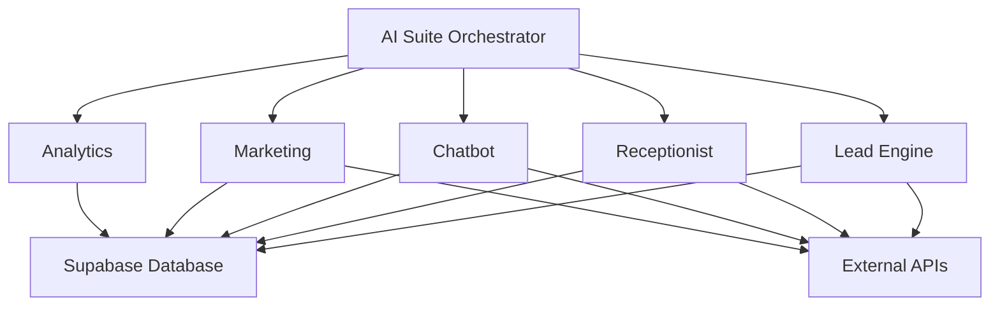

# AI Business Suite - Implementation Guide

## Overview

The AI Business Suite transforms your single AI Receptionist into a comprehensive business automation platform. This implementation provides five integrated AI services that work together to handle the complete customer lifecycle.

## Architecture

### Core Services

1. **AI Receptionist** (Existing - Enhanced)
   - Voice-based call handling
   - Appointment scheduling
   - Customer inquiries
   - Sentiment analysis

2. **Lead Generation Engine** (New)
   - Multi-channel lead capture
   - AI-powered lead scoring
   - Automated qualification
   - Personalized outreach

3. **24/7 Customer Service Chatbot** (New)
   - Multi-platform support (web, WhatsApp, SMS)
   - Intelligent query handling
   - Knowledge base integration
   - Human escalation

4. **Marketing Automation Platform** (New)
   - AI content generation
   - Email campaign automation
   - Social media management
   - Performance optimization

5. **Analytics & Insights Dashboard** (New)
   - Cross-service analytics
   - Predictive modeling
   - Business intelligence
   - ROI tracking

### Integration Points



## API Endpoints

### Lead Generation
- `POST /api/ai/leads` - Create and score leads
- `GET /api/ai/leads` - List leads with filtering
- `PUT /api/ai/leads` - Bulk import leads
- `POST /api/ai/leads/[id]/qualify` - AI lead qualification

### Customer Service Chatbot
- `POST /api/ai/chatbot` - Handle chat messages
- `GET /api/ai/chatbot` - Get conversation history

### Marketing Automation
- `POST /api/ai/marketing` - Create campaigns/posts
- `GET /api/ai/marketing` - List campaigns and performance

### Analytics & Insights
- `GET /api/ai/analytics` - Get business metrics
- `POST /api/ai/analytics` - Generate AI insights

### Suite Orchestration
- `GET /api/ai/suite` - Get suite status and metrics
- `POST /api/ai/suite/analyze` - Comprehensive business analysis
- `POST /api/ai/suite/optimize` - Service optimization
- `POST /api/ai/suite/integrate` - Cross-service integration

## Database Schema

### New Tables Added

```sql
-- Subscription and billing
subscription_plans
user_subscriptions

-- Lead management
lead_sources
leads
lead_activities

-- Customer service
knowledge_base
chat_conversations
chat_messages

-- Marketing automation
email_campaigns
social_posts
automation_workflows

-- Analytics
analytics_events
business_metrics

-- Integrations
integrations
```

## Implementation Features

### 1. AI Lead Scoring Engine

**Features:**
- Email domain analysis (business vs personal)
- Job title scoring (decision makers, influencers)
- Company size estimation using AI
- Engagement tracking
- Automatic qualification

**Scoring Criteria:**
- Business email: +15 points
- Decision maker title: +25 points
- Enterprise company: +30 points
- Form completion: +20 points

### 2. Intelligent Chatbot System

**Capabilities:**
- Natural language understanding
- Context-aware responses
- Knowledge base search
- Booking detection
- Human handoff logic
- Multi-channel support

**AI Features:**
- Intent classification
- Sentiment analysis
- Automated lead creation
- Personalized responses

### 3. Marketing Content Engine

**Content Generation:**
- Email campaigns with personalization variants
- Social media posts for multiple platforms
- Ad copy optimization
- A/B testing recommendations

**Platform Support:**
- Email (newsletters, nurture, promotional)
- Social (Facebook, Instagram, Twitter, LinkedIn, TikTok)
- Advertising copy optimization

### 4. Advanced Analytics System

**Metrics Tracked:**
- Cross-service performance
- Customer journey analysis
- ROI calculations
- Automation efficiency
- Service synergy scores

**AI Insights:**
- Performance correlations
- Growth opportunities
- Risk identification
- Predictive forecasting

## Revenue Model

### Subscription Tiers

**Essential ($99/month)**
- AI Receptionist
- Basic Chatbot
- Lead Capture Forms
- Email Automation (1,000 contacts)

**Growth ($299/month)**
- Everything in Essential
- Advanced Lead Generation
- Social Media Automation
- Analytics Dashboard
- Email Automation (10,000 contacts)

**Enterprise ($799/month)**
- Everything in Growth
- Custom AI Training
- Advanced Analytics
- CRM Integrations
- Unlimited Contacts
- White-label Options

### Projected Revenue

**Year 1:**
- 100 Growth customers: $358,800 ARR
- 20 Enterprise customers: $191,760 ARR
- **Total ARR: ~$550,000**

**Year 2:**
- 500 customers average $400/month: $2,400,000 ARR
- Add-ons and services: $600,000
- **Total ARR: ~$3,000,000**

## Technical Implementation

### AI Models Used

1. **Google Gemini 1.5 Flash** - Primary AI model
   - Lead qualification
   - Content generation
   - Analytics insights
   - Customer service responses

2. **VAPI** - Voice AI platform
   - Phone call handling
   - Voice recognition
   - Natural conversation flow

3. **Custom Scoring Models**
   - Lead scoring algorithms
   - Performance optimization
   - Automation efficiency

### External Integrations

**Communication:**
- Twilio (SMS, WhatsApp)
- SendGrid/Resend (Email)
- Social media APIs

**Analytics:**
- PostHog (Product analytics)
- Mixpanel (User behavior)
- Custom event tracking

**Business Tools:**
- CRM connectors
- Calendar integrations
- Payment processing

## Performance Metrics

### Technical KPIs
- Service uptime: >99.9%
- API response time: <200ms
- AI accuracy: >95%
- Cross-service integration: <500ms

### Business KPIs
- Monthly recurring revenue growth: >15%
- Customer acquisition cost: <$300
- Customer lifetime value: >$5,000
- Churn rate: <5% monthly

## Security & Compliance

### Data Protection
- Row Level Security (RLS) on all tables
- JWT authentication
- Input validation with Zod schemas
- Encrypted credentials storage

### API Security
- Rate limiting
- Request validation
- CORS configuration
- Webhook signature validation

## Deployment

### Prerequisites
1. Supabase project with extended schema
2. Google Gemini API key
3. VAPI account and API key
4. Email service provider
5. SMS/WhatsApp provider (optional)

### Setup Steps

1. **Database Setup**
   ```bash
   # Run the extended schema
   psql -f scripts/002_ai_suite_schema.sql
   ```

2. **Environment Variables**
   ```bash
   # Add to .env.local
   GEMINI_API_KEY=your_gemini_key
   VAPI_API_KEY=your_vapi_key
   TWILIO_API_KEY=your_twilio_key
   SENDGRID_API_KEY=your_sendgrid_key
   ```

3. **Deploy Application**
   ```bash
   npm run build
   npm run start
   ```

## Testing

### Backend Testing
```bash
# Run the demo script
python run_demo.py

# Test individual services
curl -X POST /api/ai/leads -d '{"email":"test@company.com"}'
curl -X POST /api/ai/chatbot -d '{"message":"Hello"}'
```

### Integration Testing
```bash
# Test cross-service integration
curl -X POST /api/ai/suite/integrate -d '{
  "triggerService": "leads",
  "targetServices": ["chatbot", "marketing"],
  "eventData": {"leadScore": 85}
}'
```

## Monitoring

### Health Checks
- `/api/health` - Overall system health
- Service-specific monitoring
- Real-time performance metrics

### Analytics
- Service usage tracking
- Performance monitoring
- Error rate tracking
- Customer satisfaction metrics

## Support & Documentation

### User Guides
- Getting started with AI Suite
- Service configuration guides
- Best practices documentation
- Troubleshooting guides

### Developer Resources
- API documentation
- Integration examples
- Custom development guides
- Webhook documentation

## Future Enhancements

### Phase 2 Features
- Voice cloning for receptionist
- Advanced ML models
- Custom AI training
- Enterprise integrations

### Phase 3 Features
- Multi-language support
- Industry-specific templates
- Advanced automation workflows
- White-label platform

## Conclusion

The AI Business Suite transforms a single-purpose AI Receptionist into a comprehensive business automation platform. With integrated lead generation, customer service, marketing automation, and analytics, businesses can automate their entire customer lifecycle while maintaining high-quality, personalized interactions.

The modular architecture allows for easy expansion, and the revenue model provides clear paths to $3M+ ARR within two years.